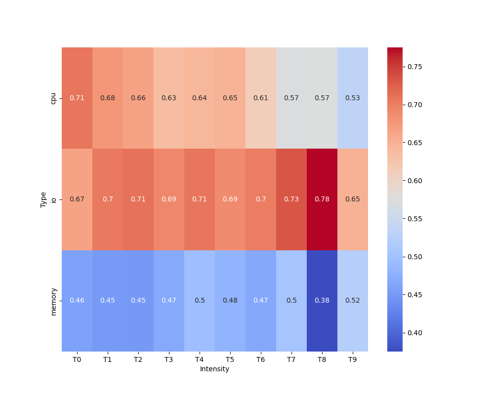
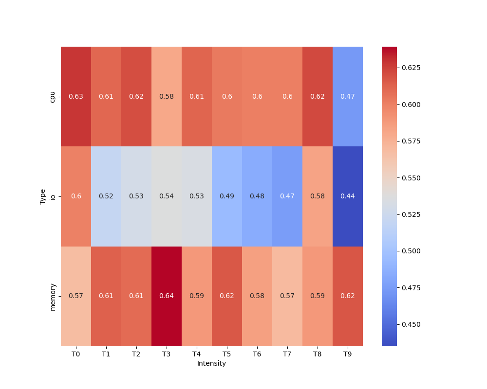
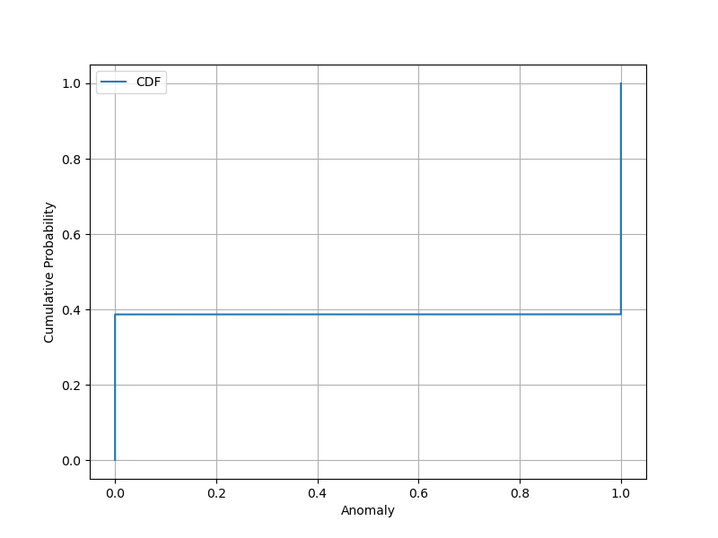
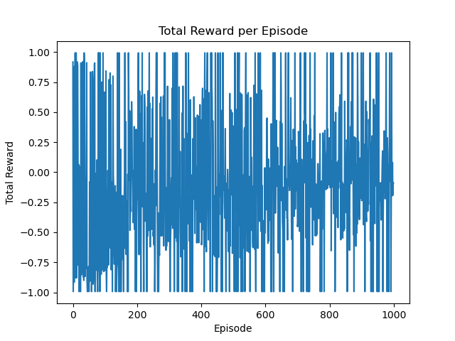

To replicate the results present in the screenshots, please follow the following steps:

NOTE: The steps work at the time of testing (18 October, 2023)

First create a python environment and install the packages from requirements.txt in the root directory of the repository.

```
pip install -r requirements.txt
```

I used miniconda to create an environment called "firm" where I installed all the required python libraries.
Please note that Python 3.10 was used.

```
conda create -n firm python=3.10 pip
conda activate firm
pip install -r requirements.txt
```

After it is installed, install minikube, istioctl and kubetnetes using your package manager for your respective operating system.

Also set up docker with networking parameter for minikube. The testing for this repository was done with network option:

```
export NO_PROXY=localhost,127.0.0.1,10.96.0.0/12,192.168.59.0/24,192.168.49.0/24,192.168.39.0/24
```

This concludes the initial prerequisites.

The next section is setup of kubernetes pods for tracing, observability and monitoring for the latency measurements.

NOTE: Please run the command in the root directory of the repository unless specified.

1. Initialize minikube cluster

```
minikube start --mount --mount-string='/path/to/repo/user/:/path/to/repo/user' --memory=7000
```

2. Initialize istio

```
istioctl install
```

3. Install the strimzi system pod in default namespace

```
kubectl apply -f https://strimzi.io/install/latest
```

4. Install the monitoring and observability services in pods.

```
export NAMESPACE='monitoring'
kubectl create -f manifests/setup
kubectl create namespace observability
kubectl create -n observability -f https://raw.githubusercontent.com/jaegertracing/jaeger-operator/v1.28.0/deploy/crds/jaegertracing.io_jaegers_crd.yaml
kubectl create -n observability -f https://raw.githubusercontent.com/jaegertracing/jaeger-operator/v1.28.0/deploy/service_account.yaml
kubectl create -n observability -f https://raw.githubusercontent.com/jaegertracing/jaeger-operator/v1.28.0/deploy/role.yaml
kubectl create -n observability -f https://raw.githubusercontent.com/jaegertracing/jaeger-operator/v1.28.0/deploy/role_binding.yaml
kubectl create -n observability -f https://raw.githubusercontent.com/jaegertracing/jaeger-operator/v1.28.0/deploy/operator.yaml
kubectl create -f https://raw.githubusercontent.com/jaegertracing/jaeger-operator/v1.28.0/deploy/cluster_role.yaml
kubectl create -f https://raw.githubusercontent.com/jaegertracing/jaeger-operator/v1.28.0/deploy/cluster_role_binding.yaml
kubectl create -f manifests/
```

5. Wait for a few minutes for all pods to start running. To check for each of the pods status run:

```
kubectl get pods --all-namespaces
```

6. While these pods are starting, change directory to anomaly-injector in the root directory of the repository and run the following:

```
cd anomaly-detector
make
cd sysbench
./autogen.sh
./configure
make -j
make install
```

Please note that this might require elevated permissions so just use sudo <command> if error persists

There might be some errors during install. Please install the following libraries to fix them: make, gcc, g++, autoconf, libtool, libmysqlclient-dev, pkg-config

7. You have to run step 6 inside the node created by the minikube service as well.

To access the minikube node system:
```
minikube ssh
```
Then run the following commands:
```
sudo apt update
sudo apt install make gcc g++ autoconf libtool pkgconfig libmysqlclient-dev -y
```
After this go to the mounted repo directory and run the same commands mentioned in 6

8. Install intel-cmt-cat through the third-party directory in the root directory

```
cd third-party
cd intel-cmt-cat
make
make install
```

Please note that this might require elevated permissions so just use sudo <command> if error persists

This concludes the initial setup of observation, monitoring, tracing, deployment modules and the anomaly injector.

The next step is generating data for SVM training. Due to limitation of system resources, training datasets for both SVM and RL training are generated using python scripts rather than a separate tracing agent as mentioned in the paper this experiment is based on.

9. First deploy the social-network benchmark of DeathStarBench. Run the following to create a social-network namespace

```
kubectl apply -f benchmarks/1-social-network/k8s-yaml/social-network-ns.yaml
```

10. The mass deploy all the modules required for the benchmark to run properly:

```
kubectl apply -f benchmarks/1-social-network/k8s-yaml/
```

Please make sure to edit each of these yaml files and enter the appropriate directory path to the repository
If incorrect path is entered the modules will not deploy.

Wait for all pods to start running. (Will take upto 5 minutes depending on teh system's available resources)

The pods status can be inferred using:

```
kubectl get pods --all-namespaces
```

For any errors or logs for any pods one can run the following command to start debugging:

```
kubectl describe pods <pod name> -n <namespace name>
```
Please note that -n <namespace name> can be replaced with --all-namespaces for ease of use.

11. Run the following command to receive the IP address for both nginx-thrift and jaeger-out component which will be required for data collection, training, anomaly injection and workload generation.

```
minikube service list
```

12. After receiving the IPs of both service, perform the next steps. Take the nginx-thrift IP and paste it to the files:
    a. /benchmarks/1-social-network/scripts/init-social-graph.py (line 74)
    b. /benchmarks/1-social-network/wrk2/scripts/src/social-network/compose-post.lua (line 67)
    c. /benchmarks/1-social-network/wrk2/scripts/src/social-network/read-home-timeline.lua (line 17)
    d. /benchmarks/1-social-network/wrk2/scripts/src/social-network/read-user-timeline.lua (line 17)

13. Take the jaeger-out IP address and paste it to the file:
    /svm/generate_data.py (line 17)

14. Compile the workload generator

```
cd /benchmarks/1-social-network/wrk2/
make
```

15. After these are done, we are ready for the next tests. To start, run the following:

```
python benchmarks/1-social-network/scripts/init-social-graph.py
```
This will generate 18000 nodes (user accounts) from with the workload generation about composing post will be carried out.

16. Run the workload generation using the commands below:

```
cd /benchmarks/1-social-network/wrk2/
```
And run the command according to the syntax:
```
./wrk -D exp -t 8 -c 100 -R 1600 -d 1h -L -s ./scripts/social-network/compose-post.lua http://<cluster-ip>:<cluster-port>/wrk2-api/post/compose
 - t: number of threads
 - c: number of connections 
 - R: rate, i.e., number of requests per second 
 - d: duration 
```

I used the following due to limitation of system resources:

```
./wrk -D exp -t 4 -c 5 -R 20 -d 15m -L -s ./scripts/social-network/compose-post.lua http://192.168.49.2:31715/wrk2-api/post/compose
```

This was run by staying on the folder path: /benchmarks/1-social-network/

17. While this is running, change directory to root folder of the repository and run the following:

```
cd svm
```

Comment out the lines 43, 44, 63, 74 and 79 during data generation and rename the data file at line 95 for proper dataset name of file generate_data.py

```
python ./generate_data.py
```

The generation data script will run for 8 minutes when generating data with no anomaly and around 12 minutes when generating data with anomaly.

18. Once the no anomaly dataset is generated, run 17 again but this time with line 63 uncommented and line 95 again with proper name

19. With the two datasets generated, copy the two files generated inside dataset folder and paste it to /svm/notebooks/

20. Open and run the following files in order to properly train the SVM model and generate the SVM model file to use in the next step: generate_data.ipynb, svm_training.ipynb

21. Once the model svm_model.joblib is generated, copy this model and paste it in the /svm/model/ directory

22. After this is performed, uncomment the lines 43, 44, 63, 74 and 79 again in file generate_data.py and generate the dataset to compare the FPR and TPR of the trained svm_model

23. The SVM training is complete. The problem with the next step is minikube does not allow dynamic allocation of resources in my machine because it is running a read-only instance every run. This is why I had to train the RL agent only to detect what type of anomaly the system was encountering. This might be quite similar as it just needs to now perform the necessary scale-out or scale-up operation in theory.

This was done my merging the two injected dataset from before SVM training and after SVM training and using gym library provided by OpenAI to create an environment which updates its classification with every episodes for training the model.

This is how the graphs at the beginning were generated.

Thank you.
